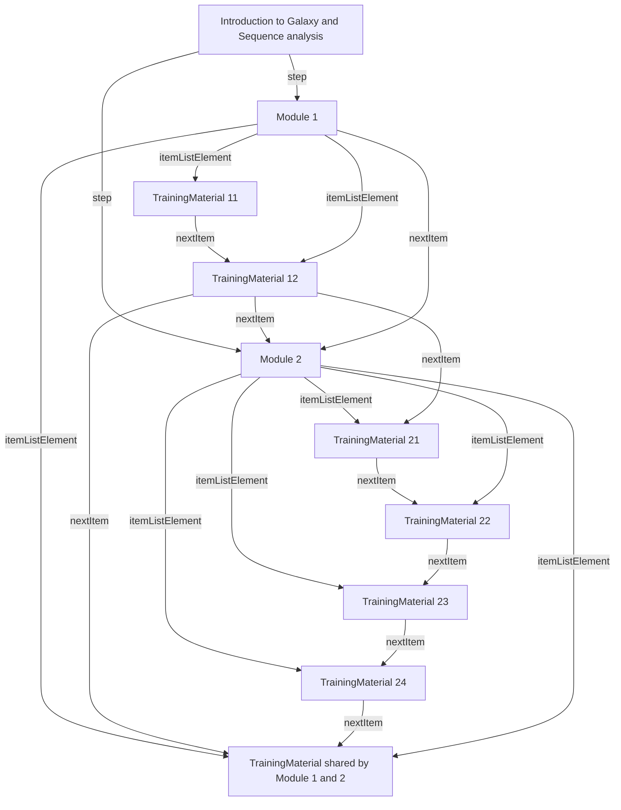
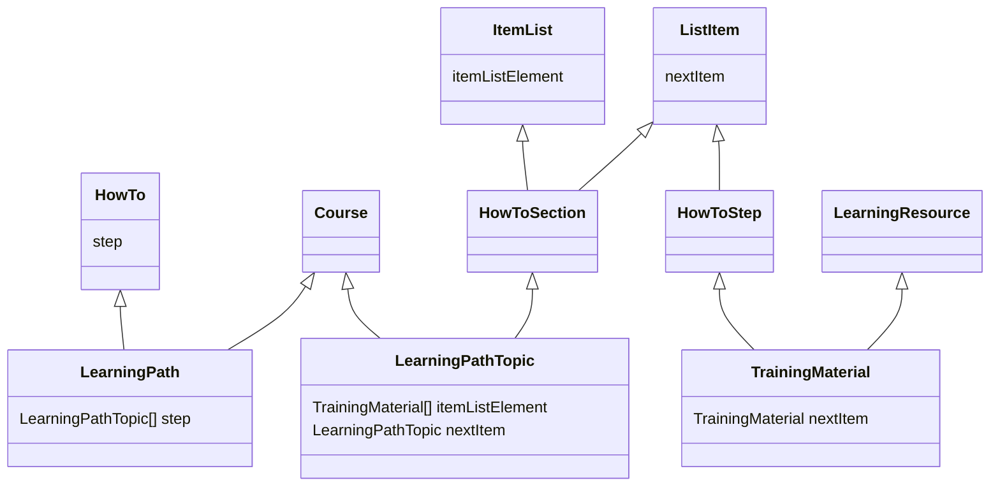

# Learning Path sandbox

authors: Phil Reed, Alban Gaignard

drafted the 20th of November 2025, as part of Bioschemas activities

To be revised by the community.

Any questions, please contact phil.reed@manchester.ac.uk, alban.gaignard@univ-nantes.fr

## Aim of the repo
Report experiments to model Learning Paths with Schema.org ontology. 

## Content 

A jupyter notebook showing :
 - How Schema.org can be used, especially the HowTo, HowToSection, and HowToStep types and the required properties to properly define order between steps.
 - Some code to query (SPARQL and property path) the semantic annotations and retrieve for a given step the learning prerequesites.
 - Some code to transform Schema.org markup into a Mermaid diagram

## Results 
A sample Learning path: 
```turtle
ex:GA_learning_path a schema:Course,
        schema:HowTo ;
    schema:courseCode "GSA101" ;
    schema:description "A foundational course for Galaxy and Sequence analysis." ;
    schema:name "Introduction to Galaxy and Sequence analysis" ;
    schema:provider ex:ExampleUniversity ;
    schema:step ex:Module_1,
        ex:Module_2 .

ex:Module_1 a schema:Course,
        schema:HowToSection ;
    schema:itemListElement ex:TM11,
        ex:TM12,
        ex:TM3 ;
    schema:name "Module 1" ;
    schema:nextItem ex:Module_2 .

ex:TM11 a schema:HowToStep,
        schema:LearningResource ;
    schema:description "Description of TrainingMaterial 11" ;
    schema:name "TrainingMaterial 11" ;
    schema:nextItem ex:TM12 ;
    schema:url "https://tess.elixir-europe.org/materials/hands-on-for-a-short-introduction-to-galaxy-tutorial?lp=1%3A1" .

ex:TM12 a schema:HowToStep,
        schema:LearningResource ;
    schema:description "Description of TrainingMaterial 12" ;
    schema:name "TrainingMaterial 12" ;
    schema:nextItem ex:Module_2,
        ex:TM21,
        ex:TM3 .
```

And the complete diagram: 


## Schema structure

We propose two new Bioschemas profiles and a small change to one Bioschemas profile:

- `LearningPath`: inherits from `Course` and `HowTo`
- `LearningPathTopic`: inherits from `Course` and `HowToSection`
- `TrainingMaterial`: inherits from `LearningResource` and `HowToStep`

A `LearningPath` has one or more `LearningPathTopic`. A `LearningPathTopic` has one or more `TrainingMaterial`. These relationships are (ordered) lists or steps, using the `HowTo` Schema.org type.

Class diagram:

