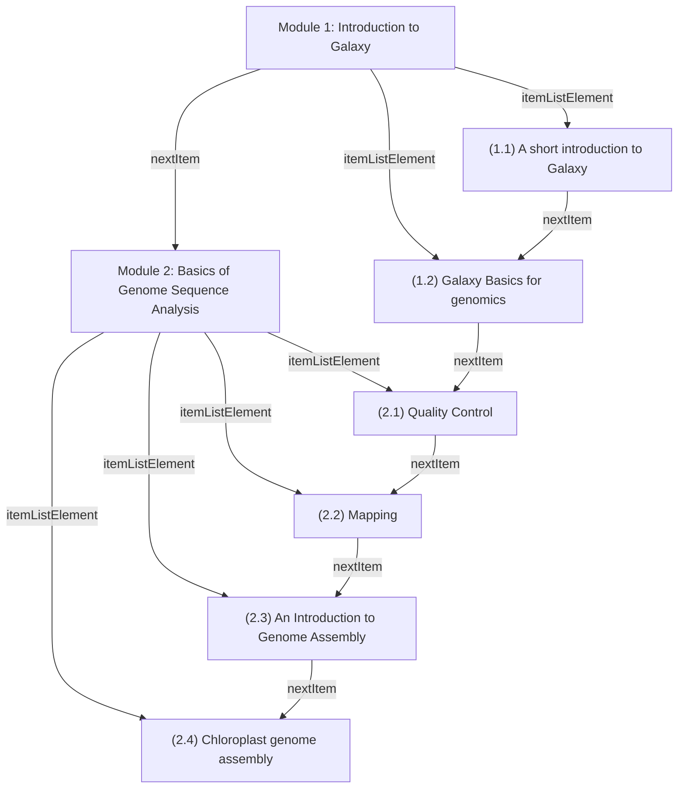
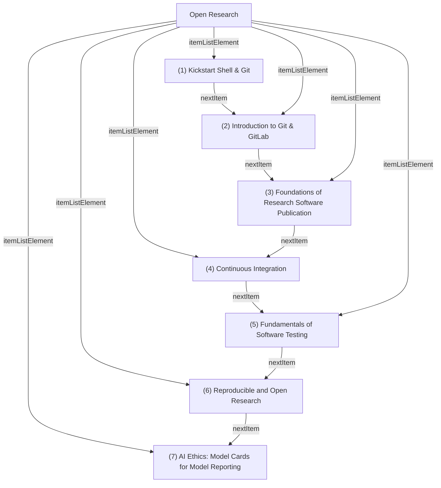
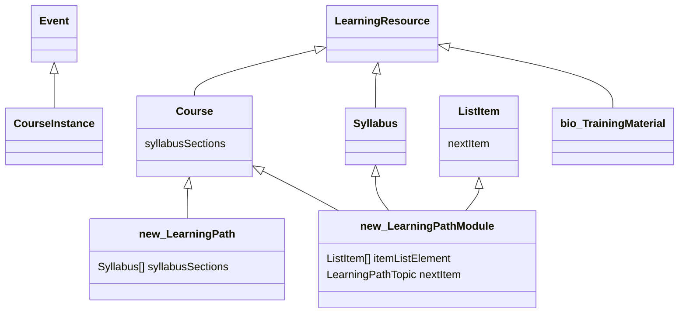
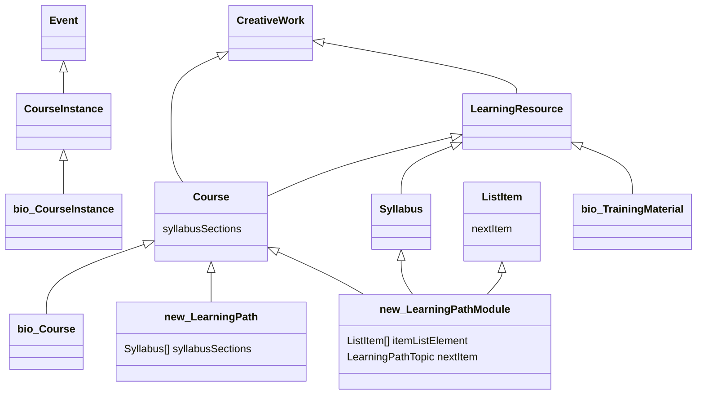

# Learning Path sandbox

authors: Phil Reed, Alban Gaignard, Leyla Jael Castro

contributors: Nick Juty, Roman Baum

- Initially drafted the 20th of November 2025, as part of Bioschemas activities and ELIXIR BioHackathon Europe 2025.
- Refined at de.NBI BioHackathon Germany 2025.
- To be revised by the community.


Any questions, please contact phil.reed@manchester.ac.uk, alban.gaignard@univ-nantes.fr

## Aim of the repo
Report experiments to model Learning Paths with Schema.org ontology. 

## Content 

A jupyter notebook showing :
 - How Schema.org can be used, especially the HowTo, HowToSection, and HowToStep types and the required properties to properly define order between steps.
 - Some code to query (SPARQL and property path) the semantic annotations and retrieve for a given step the learning prerequesites.
 - Some code to transform Schema.org markup into a Mermaid diagram

## Results 

### First example
A sample Learning path: 

https://tess.elixir-europe.org/learning_paths/introduction-to-galaxy-and-sequence-analysis-6384c0ed-3546-41cf-ac30-bff8680dd96c

LP structure: 

**Introduction to Galaxy and Sequence analysis** [syllabusSections=M1,M2]
- **Module 1: Introduction to Galaxy** [itemListElement=11,12] [nextItem=M2]
  - (1.1) A short introduction to Galaxy [nextItem=12]
  - (1.2) Galaxy Basics for genomics [nextItem=21]
- **Module 2: Basics of Genome Sequence Analysis** [itemListElement=21,22,23,24]
  - (2.1) Quality Control [nextItem=22]
  - (2.2) Mapping [nextItem=23]
  - (2.3) An Introduction to Genome Assembly [nextItem=24]
  - (2.4) Chloroplast genome assembly 

```turtle
@prefix dct: <http://purl.org/dc/terms/> .
@prefix ex: <http://example.org/> .
@prefix schema: <https://schema.org/> .

ex:GA_learning_path a schema:Course ;
    dct:conformsTo <https://bioschemas.org/profiles/LearningPath> ;
    schema:courseCode "GSA101" ;
    schema:description "This learning path aims to teach you the basics of Galaxy and analysis of sequencing data. " ;
    schema:name "Introduction to Galaxy and Sequence analysis" ;
    schema:provider ex:ExampleUniversity ;
    schema:syllabusSections ex:Module_1,
        ex:Module_2 .

ex:Module_1 a schema:ItemList,
        schema:ListItem,
        schema:Syllabus ;
    dct:conformsTo <https://bioschemas.org/profiles/LearningPathModule> ;
    schema:itemListElement ex:TM11,
        ex:TM12 ;
    schema:name "Module 1: Introduction to Galaxy" ;
    schema:nextItem ex:Module_2 ;
    schema:teaches "Learn how to create a workflow" .

ex:TM11 a schema:LearningResource,
        schema:ListItem ;
    dct:conformsTo <https://bioschemas.org/profiles/TrainingMaterial> ;
    schema:description "What is Galaxy" ;
    schema:name "(1.1) A short introduction to Galaxy" ;
    schema:nextItem ex:TM12 ;
    schema:url "https://tess.elixir-europe.org/materials/hands-on-for-a-short-introduction-to-galaxy-tutorial?lp=1%3A1" .
```

And the complete diagram: 


### Second example

This is a module of a learning path graph where each item is a course instance (event), not a training material. They provide a linear reduction which we will model. This reduction supports the prerequisites in a simplified way, and ignores courses from other modules (Open Oriented Programming). 


https://www.helmholtz-hida.de/en/discover-hida/helmholtz-information-data-science-framework/data-science-course-portfolio/

LP structure: 

**Helmholtz Data Science Course Portfolio** [syllabusSections=M1]
- **Module: Open Research** [itemListElement=1,2,3,4,5,6,7]
  - (1) Kickstart Shell & Git [nextItem=2]
    - 22-23 September 2025
  - (2) Introduction to Git & GitLab [nextItem=3]
    - 15-16 September 2025
    - 24-25 November 2025
  - (3) Foundations of Research Software Publication [nextItem=4]
    - 6-7 November 2025
  - (4) Continuous Integration [nextItem=5]
    - 28-29 October 2025
    - 16-17 December 2025
  - (5) Fundamentals of Software Testing [nextItem=6]
    - No instances yet
  - (6) Reproducible and Open Research [nextItem=7] 
    - 19 November 2025
  - (7) AI Ethics: Model Cards for Model Reporting
    - 17 October 2025

Each course may have multiple course instances.

```turtle
hz:HZ_learning_path a schema:Course ;
    dct:conformsTo <https://bioschemas.org/profiles/LearningPath> ;
    schema:courseCode "data-science-course-portfolio" ;
    schema:description "The platforms of the Information & Data Science Framework have developed a coordinated course offer that covers a wide array of topics." ;
    schema:name "Helmholtz Data Science Course Portfolio" ;
    schema:provider hz:Helmholtz ;
    schema:syllabusSections hz:Module_1 .

hz:Module_1 a schema:Course,
        schema:ItemList,
        schema:ListItem,
        schema:Syllabus ;
    dct:conformsTo <https://bioschemas.org/profiles/LearningPathModule> ;
    schema:description "Unlock the potential of open science through courses on collaborative research practices and project management, open-source tools and software, and publishing ethically sound, reproducible, and transparent results." ;
    schema:itemListElement hz:TM1,
        hz:TM2,
        hz:TM3,
        hz:TM4,
        hz:TM5,
        hz:TM6,
        hz:TM7 ;
    schema:name "Open Research" ;
    schema:teaches "Learn how to support open science" .

hz:TM1 a schema:Course,
        schema:ListItem ;
    dct:conformsTo <https://bioschemas.org/profiles/Course> ;
    schema:description "Boost your research efficiency with this workshop on Bash scripting and Git version control. Learn to automate tasks with custom scripts and track your work with Git" ;
    schema:hasCourseInstance hz:TM1a ;
    schema:name "(1) Kickstart Shell & Git" ;
    schema:nextItem hz:TM2 ;
    schema:url "https://www.helmholtz-hida.de/en/lernen-vernetzen/data-science-course-portfolio/kickstart-shell-git/" .

hz:TM1a a schema:CourseInstance ;
    dct:conformsTo <https://bioschemas.org/profiles/CourseInstance> ;
    schema:courseMode "online" ;
    schema:endDate "2025-09-23T17:00:00" ;
    schema:startDate "2025-09-22T09:00:00" .
```

And the complete diagram: 



## Schema structure

We propose two new Bioschemas profiles and a small change to [one Bioschemas profile](https://bioschemas.org/profiles/TrainingMaterial/1.0-RELEASE):

- `LearningPath`: inherits from `Course`
- `LearningPathModule`: inherits from `Course` and `Syllabus` and `ListItem` and `ItemList`
- `TrainingMaterial`: inherits from `LearningResource` and `ListItem`

A `LearningPath` has zero or more `LearningPathModule`. A `LearningPathModule` has zero or more `LearningResource`. These relationships are (ordered) lists or steps, using the `ItemList` and `Syllabus` Schema.org types.

Class diagram:


More detailed class diagram, including the distinction where there is a Schema.org type with the same name as a Bioschemas profile:
