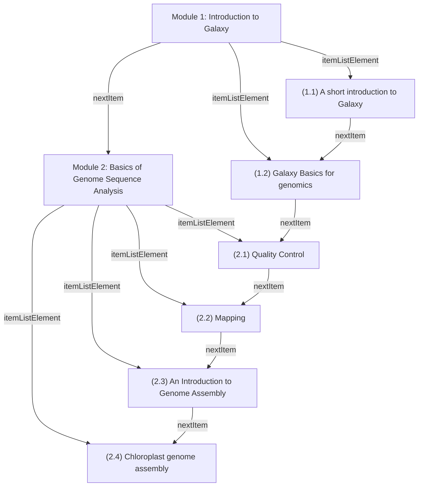
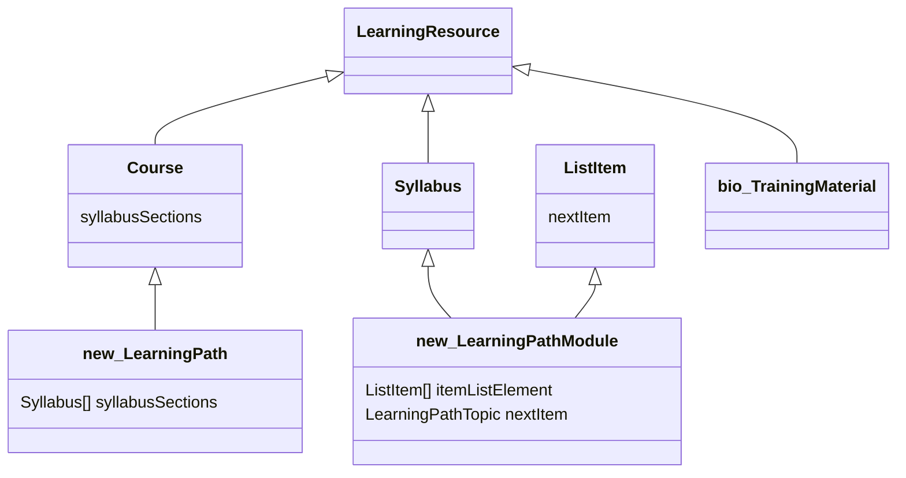

# Learning Path sandbox

authors: Phil Reed, Alban Gaignard, Leyla Jael Castro

- Initially drafted the 20th of November 2025, as part of Bioschemas activities and ELIXIR BioHackathon Europe 2025.
- Refined at de.NBI BioHackathon Germany 2025.
- To be revised by the community.


Any questions, please contact phil.reed@manchester.ac.uk, alban.gaignard@univ-nantes.fr

## Aim of the repo
Report experiments to model Learning Paths with Schema.org ontology. 

## Content 

A jupyter notebook showing :
 - How Schema.org can be used, especially the HowTo, HowToSection, and HowToStep types and the required properties to properly define order between steps.
 - Some code to query (SPARQL and property path) the semantic annotations and retrieve for a given step the learning prerequesites.
 - Some code to transform Schema.org markup into a Mermaid diagram

## Results 
A sample Learning path: 

https://tess.elixir-europe.org/learning_paths/introduction-to-galaxy-and-sequence-analysis-6384c0ed-3546-41cf-ac30-bff8680dd96c

LP structure: 

**Introduction to Galaxy and Sequence analysis** [syllabusSections=M1,M2]
- **Module 1: Introduction to Galaxy** [itemListElement=11,12] [nextItem=M2]
  - (1.1) A short introduction to Galaxy [nextItem=12]
  - (1.2) Galaxy Basics for genomics [nextItem=21]
- **Module 2: Basics of Genome Sequence Analysis** [itemListElement=21,22,23,24]
  - (2.1) Quality Control [nextItem=22]
  - (2.2) Mapping [nextItem=23]
  - (2.3) An Introduction to Genome Assembly [nextItem=24]
  - (2.4) Chloroplast genome assembly 

```turtle
@prefix dct: <http://purl.org/dc/terms/> .
@prefix ex: <http://example.org/> .
@prefix schema: <https://schema.org/> .

ex:GA_learning_path a schema:Course ;
    dct:conformsTo <https://bioschemas.org/profiles/LearningPath> ;
    schema:courseCode "GSA101" ;
    schema:description "This learning path aims to teach you the basics of Galaxy and analysis of sequencing data. " ;
    schema:name "Introduction to Galaxy and Sequence analysis" ;
    schema:provider ex:ExampleUniversity ;
    schema:syllabusSections ex:Module_1,
        ex:Module_2 .

ex:Module_1 a schema:ItemList,
        schema:ListItem,
        schema:Syllabus ;
    dct:conformsTo <https://bioschemas.org/profiles/LearningPathModule> ;
    schema:itemListElement ex:TM11,
        ex:TM12 ;
    schema:name "Module 1: Introduction to Galaxy" ;
    schema:nextItem ex:Module_2 ;
    schema:teaches "Learn how to create a workflow" .

ex:TM11 a schema:LearningResource,
        schema:ListItem ;
    dct:conformsTo <https://bioschemas.org/profiles/TrainingMaterial> ;
    schema:description "What is Galaxy" ;
    schema:name "(1.1) A short introduction to Galaxy" ;
    schema:nextItem ex:TM12 ;
    schema:url "https://tess.elixir-europe.org/materials/hands-on-for-a-short-introduction-to-galaxy-tutorial?lp=1%3A1" .
```

And the complete diagram: 


## Schema structure

We propose two new Bioschemas profiles and a small change to [one Bioschemas profile](https://bioschemas.org/profiles/TrainingMaterial/1.0-RELEASE):

- `LearningPath`: inherits from `Course`
- `LearningPathModule`: inherits from `Course` and `Syllabus` and `ListItem` and `ItemList`
- `TrainingMaterial`: inherits from `LearningResource` and `ListItem`

A `LearningPath` has zero or more `LearningPathModule`. A `LearningPathModule` has zero or more `LearningResource`. These relationships are (ordered) lists or steps, using the `ItemList` and `Syllabus` Schema.org types.

Class diagram:

