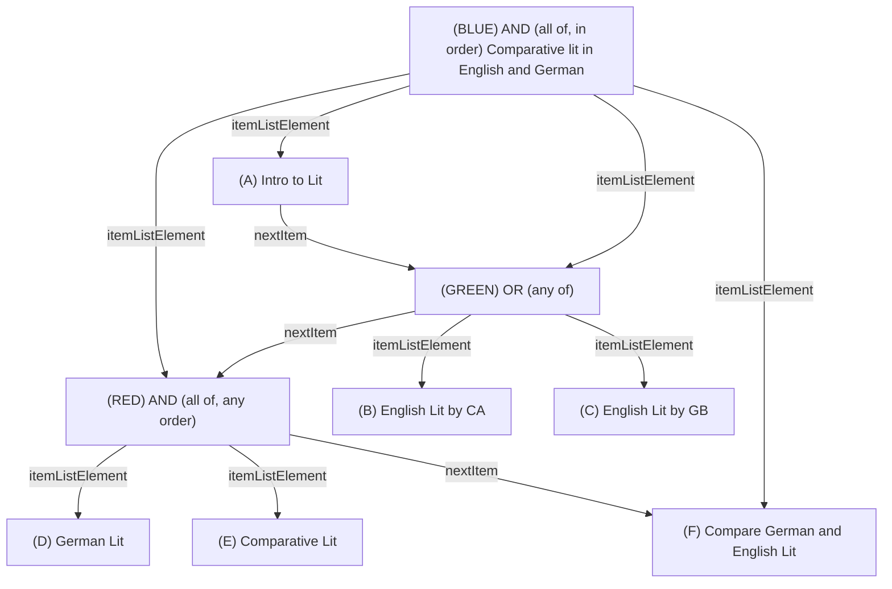
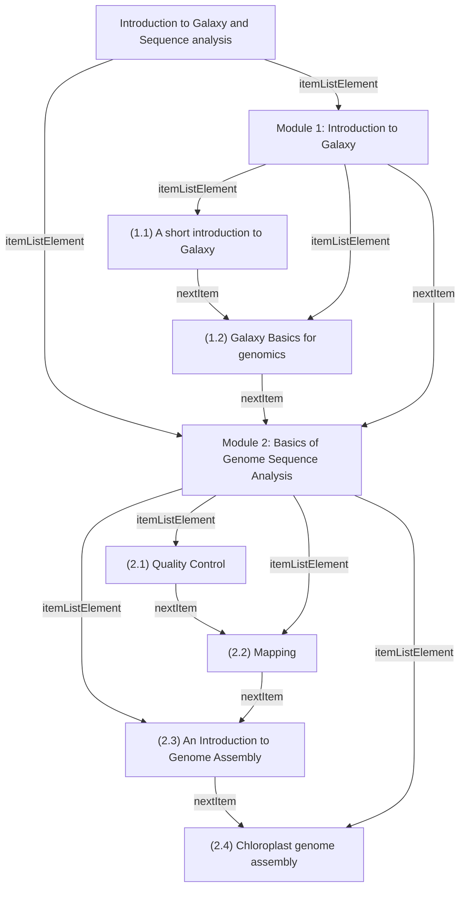
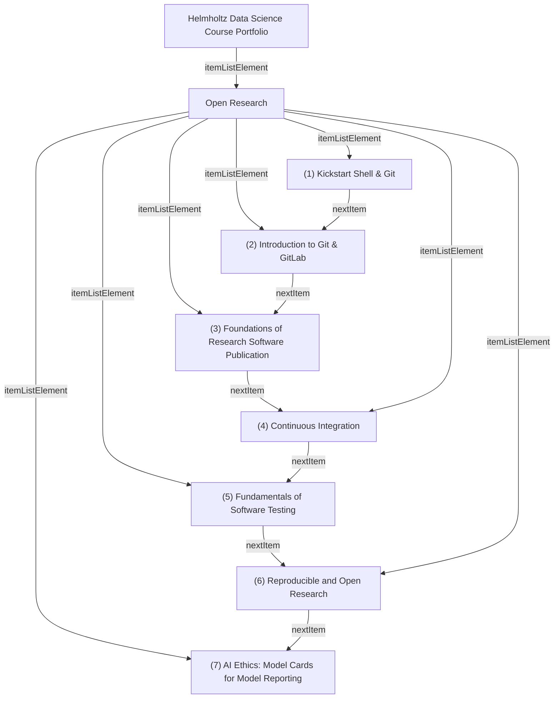
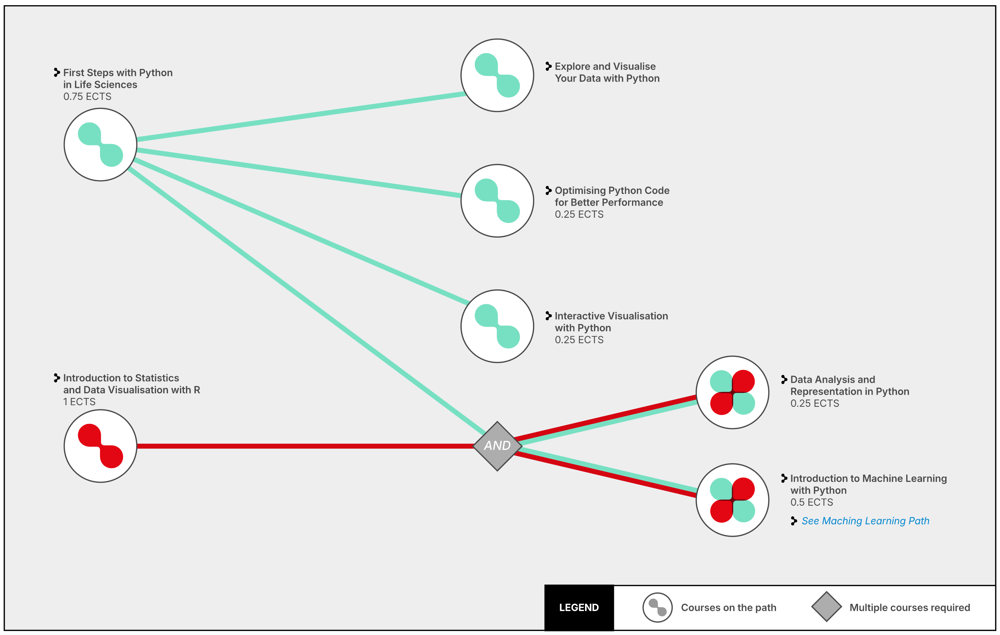
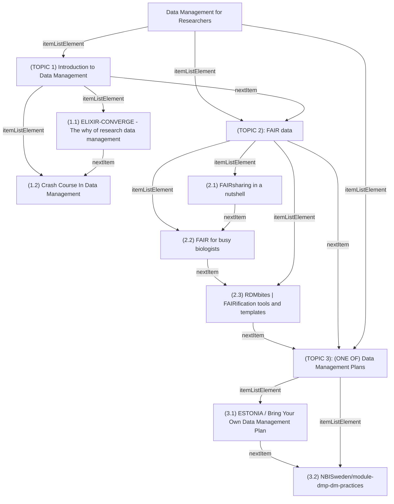
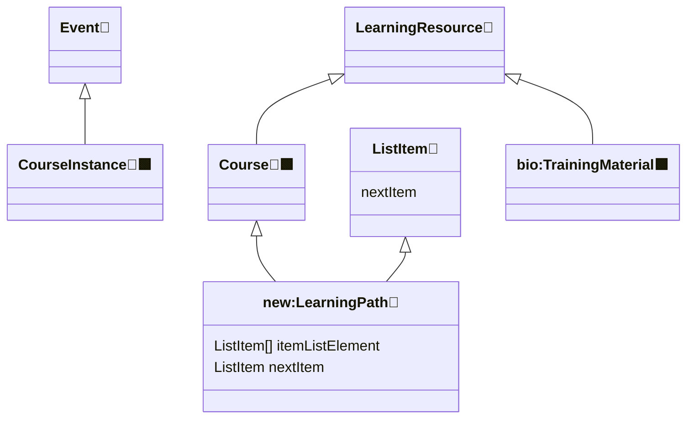
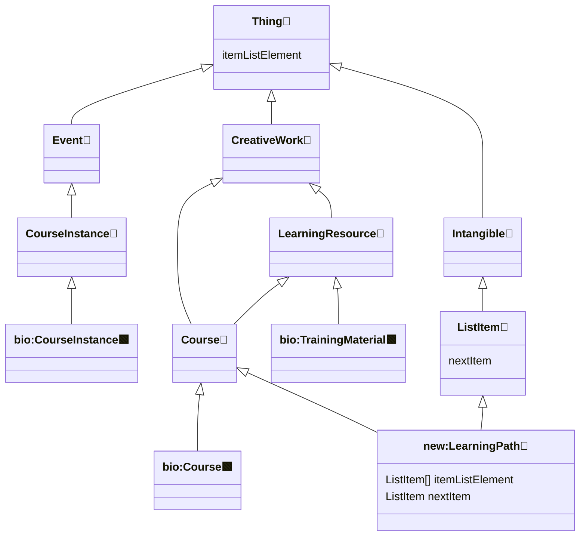

# Learning Path sandbox

authors: Phil Reed, Alban Gaignard, Leyla Jael Castro, Michelle Brazas, Alex Smith, Patricia Palagi, Geert van Geest

contributors: Nick Juty, Roman Baum, Ginger Tsueng

- Initially drafted the 20th of November 2025, as part of Bioschemas activities and ELIXIR BioHackathon Europe 2025.
- Refined at de.NBI BioHackathon Germany 2025. [Report on BioHackrXiv](https://doi.org/10.37044/osf.io/un6cd_v1)
- To be revised by the community, including [Bioschemas Training Group](https://bioschemas.org/groups/Training).


Any questions, please contact phil.reed@manchester.ac.uk, alban.gaignard@univ-nantes.fr

## Aim of the repo
Report experiments to model Learning Paths with Schema.org ontology. 

## Content 

A Jupyter notebook showing :
 - How Schema.org can be used, especially the HowTo, HowToSection, and HowToStep types and the required properties to properly define order between steps.
 - Some code to query (SPARQL and property path) the semantic annotations and retrieve for a given step the learning prerequesites.
 - Some code to transform Schema.org markup into a Mermaid diagram

## Results 

### Fictitious example

This [fictitious example](https://excalidraw.com/#room=ea0226411da9573d4713,xo1L4PsDpqMqUyzdcyvxSg) demonstrates the multiple ways to combine materials: AND (all of, in order), AND (all of, any order), OR (any of).


LP structure:

- (BLUE) AND / ALL OF / IN ORDER:
  - (A) Intro to Lit [nextItem=GREEN]
  - (GREEN) OR / ANY OF [nextItem=RED]
    - (B) English Lit by CA
    - (C) English Lit by GB
  - (RED) AND / ALL OF / ANY ORDER: [nextItem=F]
    - (D) German Lit
    - (E) Comparative Lit
  - (F) Compare German and English Lit

```turtle
@prefix dct: <http://purl.org/dc/terms/> .
@prefix ex: <http://example.org/> .
@prefix schema: <https://schema.org/> .

ex:BLUE a schema:Course ;
    dct:conformsTo <https://bioschemas.org/profiles/LearningPath> ;
    schema:courseCode "LIT123" ;
    schema:description "This learning path aims to teach you the basics of comparative literature in English, German and across both. " ;
    schema:itemListElement ex:A,
        ex:F,
        ex:GREEN,
        ex:RED ;
    schema:name "(BLUE) AND (all of, in order) Comparative lit in English and German" ;
    schema:provider ex:ExampleUniversity .

ex:A a schema:Course,
        schema:ListItem ;
    dct:conformsTo <https://bioschemas.org/profiles/TrainingMaterial> ;
    schema:description "Introduction to Literature" ;
    schema:name "(A) Intro to Lit" ;
    schema:nextItem ex:GREEN ;
    schema:teaches "Learn how to discuss literature" ;
    schema:url "http://example.org/material/A" .

ex:B a schema:LearningResource,
        schema:ListItem ;
    dct:conformsTo <https://bioschemas.org/profiles/TrainingMaterial> ;
    schema:description "English Literature in Canadian English" ;
    schema:name "(B) English Lit by CA" ;
    schema:url "http://example.org/material/B" .
```

And the complete diagram: 

```mermaid
graph TD
N0["(BLUE) AND (all of, in order) Comparative lit in English and German"]
N5["(RED) AND (all of, any order)"]
N0 -- itemListElement --> N5
N0["(BLUE) AND (all of, in order) Comparative lit in English and German"]
N1["(A) Intro to Lit"]
N0 -- itemListElement --> N1
N2["(GREEN) OR (any of)"]
N3["(B) English Lit by CA"]
N2 -- itemListElement --> N3
N5["(RED) AND (all of, any order)"]
N6["(D) German Lit"]
N5 -- itemListElement --> N6
N2["(GREEN) OR (any of)"]
N5["(RED) AND (all of, any order)"]
N2 -- nextItem --> N5
N5["(RED) AND (all of, any order)"]
N7["(E) Comparative Lit"]
N5 -- itemListElement --> N7
N2["(GREEN) OR (any of)"]
N4["(C) English Lit by GB"]
N2 -- itemListElement --> N4
N1["(A) Intro to Lit"]
N2["(GREEN) OR (any of)"]
N1 -- nextItem --> N2
N5["(RED) AND (all of, any order)"]
N8["(F) Compare German and English Lit"]
N5 -- nextItem --> N8
N0["(BLUE) AND (all of, in order) Comparative lit in English and German"]
N8["(F) Compare German and English Lit"]
N0 -- itemListElement --> N8
N0["(BLUE) AND (all of, in order) Comparative lit in English and German"]
N2["(GREEN) OR (any of)"]
N0 -- itemListElement --> N2
```

### First example
A sample linear learning path from Galaxy Training Network, hosted in TeSS: 

https://tess.elixir-europe.org/learning_paths/introduction-to-galaxy-and-sequence-analysis-6384c0ed-3546-41cf-ac30-bff8680dd96c

LP structure: 
 
**Introduction to Galaxy and Sequence analysis** [itemListElement=M1,M2]
- **Module 1: Introduction to Galaxy** [itemListElement=11,12] [nextItem=M2]
  - (1.1) A short introduction to Galaxy [nextItem=12]
  - (1.2) Galaxy Basics for genomics [nextItem=M2]
- **Module 2: Basics of Genome Sequence Analysis** [itemListElement=21,22,23,24]
  - (2.1) Quality Control [nextItem=22]
  - (2.2) Mapping [nextItem=23]
  - (2.3) An Introduction to Genome Assembly [nextItem=24]
  - (2.4) Chloroplast genome assembly 


```turtle
@prefix dct: <http://purl.org/dc/terms/> .
@prefix gtn: <https://training.galaxyproject.org/> .
@prefix schema: <https://schema.org/> .

gtn:GA_learning_path a schema:Course ;
    dct:conformsTo <https://bioschemas.org/profiles/LearningPath> ;
    schema:courseCode "GSA101" ;
    schema:description "This learning path aims to teach you the basics of Galaxy and analysis of sequencing data. " ;
    schema:itemListElement gtn:Module_1,
        gtn:Module_2 ;
    schema:name "Introduction to Galaxy and Sequence analysis" ;
    schema:provider gtn:ExampleUniversity .

gtn:Module_1 a schema:Course,
        schema:ItemList,
        schema:ListItem ;
    dct:conformsTo <https://bioschemas.org/profiles/LearningPath> ;
    schema:itemListElement gtn:TM11,
        gtn:TM12 ;
    schema:name "Module 1: Introduction to Galaxy" ;
    schema:nextItem gtn:Module_2 ;
    schema:teaches "Learn how to create a workflow" .

gtn:TM11 a schema:LearningResource,
        schema:ListItem ;
    dct:conformsTo <https://bioschemas.org/profiles/TrainingMaterial> ;
    schema:description "What is Galaxy" ;
    schema:name "(1.1) A short introduction to Galaxy" ;
    schema:nextItem gtn:TM12 ;
    schema:url "https://tess.elixir-europe.org/materials/hands-on-for-a-short-introduction-to-galaxy-tutorial?lp=1%3A1" .
```

And the complete diagram: 

```mermaid
graph TD
N4["Module 2: Basics of Genome Sequence Analysis"]
N7["(2.3) An Introduction to Genome Assembly"]
N4 -- itemListElement --> N7
N0["Introduction to Galaxy and Sequence analysis"]
N4["Module 2: Basics of Genome Sequence Analysis"]
N0 -- itemListElement --> N4
N7["(2.3) An Introduction to Genome Assembly"]
N8["(2.4) Chloroplast genome assembly"]
N7 -- nextItem --> N8
N4["Module 2: Basics of Genome Sequence Analysis"]
N8["(2.4) Chloroplast genome assembly"]
N4 -- itemListElement --> N8
N3["(1.2) Galaxy Basics for genomics"]
N4["Module 2: Basics of Genome Sequence Analysis"]
N3 -- nextItem --> N4
N2["(1.1) A short introduction to Galaxy"]
N3["(1.2) Galaxy Basics for genomics"]
N2 -- nextItem --> N3
N4["Module 2: Basics of Genome Sequence Analysis"]
N5["(2.1) Quality Control"]
N4 -- itemListElement --> N5
N5["(2.1) Quality Control"]
N6["(2.2) Mapping"]
N5 -- nextItem --> N6
N1["Module 1: Introduction to Galaxy"]
N3["(1.2) Galaxy Basics for genomics"]
N1 -- itemListElement --> N3
N4["Module 2: Basics of Genome Sequence Analysis"]
N6["(2.2) Mapping"]
N4 -- itemListElement --> N6
N0["Introduction to Galaxy and Sequence analysis"]
N1["Module 1: Introduction to Galaxy"]
N0 -- itemListElement --> N1
N1["Module 1: Introduction to Galaxy"]
N2["(1.1) A short introduction to Galaxy"]
N1 -- itemListElement --> N2
N6["(2.2) Mapping"]
N7["(2.3) An Introduction to Genome Assembly"]
N6 -- nextItem --> N7
N1["Module 1: Introduction to Galaxy"]
N4["Module 2: Basics of Genome Sequence Analysis"]
N1 -- nextItem --> N4
```

### Second example

This is a module of a learning path graph where each item is a course instance (event), not a training material. They provide a linear reduction which we will model. This reduction supports the prerequisites in a simplified way, and ignores courses from other modules (Open Oriented Programming). 


https://www.helmholtz-hida.de/en/discover-hida/helmholtz-information-data-science-framework/data-science-course-portfolio/

LP structure: 

**Helmholtz Data Science Course Portfolio** [itemListElement=M1]
- **Module: Open Research** [itemListElement=1,2,3,4,5,6,7]
  - (1) Kickstart Shell & Git [nextItem=2]
    - 22-23 September 2025
  - (2) Introduction to Git & GitLab [nextItem=3]
    - 15-16 September 2025
    - 24-25 November 2025
  - (3) Foundations of Research Software Publication [nextItem=4]
    - 6-7 November 2025
  - (4) Continuous Integration [nextItem=5]
    - 28-29 October 2025
    - 16-17 December 2025
  - (5) Fundamentals of Software Testing [nextItem=6]
    - No instances yet
  - (6) Reproducible and Open Research [nextItem=7] 
    - 19 November 2025
  - (7) AI Ethics: Model Cards for Model Reporting
    - 17 October 2025

Each course may have multiple course instances.

```turtle
hz:HZ_learning_path a schema:Course ;
    dct:conformsTo <https://bioschemas.org/profiles/LearningPath> ;
    schema:courseCode "data-science-course-portfolio" ;
    schema:description "The platforms of the Information & Data Science Framework have developed a coordinated course offer that covers a wide array of topics." ;
    schema:itemListElement hz:Module_1 ;
    schema:name "Helmholtz Data Science Course Portfolio" ;
    schema:provider hz:Helmholtz .

hz:Module_1 a schema:Course,
        schema:ItemList,
        schema:ListItem ;
    dct:conformsTo <https://bioschemas.org/profiles/LearningPathModule> ;
    schema:description "Unlock the potential of open science through courses on collaborative research practices and project management, open-source tools and software, and publishing ethically sound, reproducible, and transparent results." ;
    schema:itemListElement hz:TM1,
        hz:TM2,
        hz:TM3,
        hz:TM4,
        hz:TM5,
        hz:TM6,
        hz:TM7 ;
    schema:name "Open Research" ;
    schema:teaches "Learn how to support open science" .

hz:TM1 a schema:Course,
        schema:ListItem ;
    dct:conformsTo <https://bioschemas.org/profiles/Course> ;
    schema:description "Boost your research efficiency with this workshop on Bash scripting and Git version control. Learn to automate tasks with custom scripts and track your work with Git" ;
    schema:hasCourseInstance hz:TM1a ;
    schema:name "(1) Kickstart Shell & Git" ;
    schema:nextItem hz:TM2 ;
    schema:url "https://www.helmholtz-hida.de/en/lernen-vernetzen/data-science-course-portfolio/kickstart-shell-git/" .

hz:TM1a a schema:CourseInstance ;
    dct:conformsTo <https://bioschemas.org/profiles/CourseInstance> ;
    schema:courseMode "online" ;
    schema:endDate "2025-09-23T17:00:00" ;
    schema:startDate "2025-09-22T09:00:00" .
```

And the complete diagram: 

```mermaid
graph TD
N1["Open Research"]
N4["(3) Foundations of Research Software Publication"]
N1 -- itemListElement --> N4
N1["Open Research"]
N3["(2) Introduction to Git & GitLab"]
N1 -- itemListElement --> N3
N1["Open Research"]
N6["(5) Fundamentals of Software Testing"]
N1 -- itemListElement --> N6
N2["(1) Kickstart Shell & Git"]
N3["(2) Introduction to Git & GitLab"]
N2 -- nextItem --> N3
N0["Helmholtz Data Science Course Portfolio"]
N1["Open Research"]
N0 -- itemListElement --> N1
N4["(3) Foundations of Research Software Publication"]
N5["(4) Continuous Integration"]
N4 -- nextItem --> N5
N1["Open Research"]
N8["(7) AI Ethics: Model Cards for Model Reporting"]
N1 -- itemListElement --> N8
N6["(5) Fundamentals of Software Testing"]
N7["(6) Reproducible and Open Research"]
N6 -- nextItem --> N7
N1["Open Research"]
N5["(4) Continuous Integration"]
N1 -- itemListElement --> N5
N1["Open Research"]
N7["(6) Reproducible and Open Research"]
N1 -- itemListElement --> N7
N1["Open Research"]
N2["(1) Kickstart Shell & Git"]
N1 -- itemListElement --> N2
N3["(2) Introduction to Git & GitLab"]
N4["(3) Foundations of Research Software Publication"]
N3 -- nextItem --> N4
N5["(4) Continuous Integration"]
N6["(5) Fundamentals of Software Testing"]
N5 -- nextItem --> N6
N7["(6) Reproducible and Open Research"]
N8["(7) AI Ethics: Model Cards for Model Reporting"]
N7 -- nextItem --> N8
```

### Third example

This is a learning path graph of elearning materials, where some also have course instances (events). There are some choices for the learner. There is one node which requires prerequisites from an additional learning paths. https://www.sib.swiss/training/learning-paths?path=data-science-with-python



The code for this example is still in development. It is likely out-of-scope for this work due to the high complexity of hosting multiple paths at once.


### Fourth example

This is from ELIXIR, [Data Management for Researchers](https://tess.elixir-europe.org/learning_paths/data-management-for-researchers), an excerpt of a learning path graph of learning materials, grouped by topic. There are some choices for the learner, where a topic contains a choice of materials from different countries, and the learner only needs to pick one. 


LP structure: 

**ELIXIR: Data Management for Researchers** [itemListElement=T1,T2,T3,...] 
- **(TOPIC_1) Introduction to Data Management** [itemListElement=11,12,...] [nextItem=T2]
  - (1.1) ELIXIR-CONVERGE - The why of research data management [nextItem=12]
  - (1.2) Crash Course In Data Management [nextItem=13]
  - ...
- **(TOPIC_2) FAIR data** [itemListElement=21,22,23,...] [nextItem=T3]
  - (2.1) FAIRsharing in a nutshell [nextItem=22]
  - (2.2) FAIR for busy biologists [nextItem=23]
  - (2.3) RDMbites | FAIRification tools and templates [nextItem=T3]
- **(TOPIC_3) (ONE OF) Data Management Plans** [itemListElement=31,32,...] [nextItem=...]
  - (3.1) Bring Your Own Data Management Plans [nextItem=32]
  - (3.2) NBISweden/module-dmp-dm-practices [nextItem=...]
  - ...
- ...

```turtle
ee:GA_learning_path a schema:Course ;
    dct:conformsTo <https://bioschemas.org/profiles/LearningPath> ;
    schema:courseCode "data-management-for-researchers" ;
    schema:description "The Data Management for Researchers learning path is designed to support researchers in developing strong, practical skills across the entire data lifecycle. " ;
    schema:itemListElement ee:Topic_1,
        ee:Topic_2,
        ee:Topic_3 ;
    schema:name "Data Management for Researchers" ;
    schema:provider ee:ELIXIR_Europe .

ee:TM11 a schema:LearningResource,
        schema:ListItem ;
    dct:conformsTo <https://bioschemas.org/profiles/TrainingMaterial> ;
    schema:description "...learn about data management plans, from data stewards to FAIR principles" ;
    schema:name "(1.1) ELIXIR-CONVERGE - The why of research data management" ;
    schema:nextItem ee:TM12 ;
    schema:url "https://www.youtube.com/watch?v=S7HfUe1hWcg" .

ee:TM21 a schema:LearningResource,
        schema:ListItem ;
    dct:conformsTo <https://bioschemas.org/profiles/TrainingMaterial> ;
    schema:description "...context of the BY-COVID project" ;
    schema:name "(2.1) FAIRsharing in a nutshell" ;
    schema:nextItem ee:TM22 ;
    schema:url "https://fairsharing.org/educational#nutshell" .
```

And the complete diagram: 

```mermaid
graph TD
N6["(2.2) FAIR for busy biologists"]
N7["(2.3) RDMbites | FAIRification tools and templates"]
N6 -- nextItem --> N7
N0["Data Management for Researchers"]
N1["(TOPIC 1) Introduction to Data Management"]
N0 -- itemListElement --> N1
N9["(3.1) ESTONIA / Bring Your Own Data Management Plan"]
N10["(3.2) NBISweden/module-dmp-dm-practices"]
N9 -- nextItem --> N10
N7["(2.3) RDMbites | FAIRification tools and templates"]
N8["(TOPIC 3): (ONE OF) Data Management Plans"]
N7 -- nextItem --> N8
N4["(TOPIC 2): FAIR data"]
N7["(2.3) RDMbites | FAIRification tools and templates"]
N4 -- itemListElement --> N7
N1["(TOPIC 1) Introduction to Data Management"]
N3["(1.2) Crash Course In Data Management"]
N1 -- itemListElement --> N3
N2["(1.1) ELIXIR-CONVERGE - The why of research data management"]
N3["(1.2) Crash Course In Data Management"]
N2 -- nextItem --> N3
N8["(TOPIC 3): (ONE OF) Data Management Plans"]
N10["(3.2) NBISweden/module-dmp-dm-practices"]
N8 -- itemListElement --> N10
N4["(TOPIC 2): FAIR data"]
N8["(TOPIC 3): (ONE OF) Data Management Plans"]
N4 -- nextItem --> N8
N4["(TOPIC 2): FAIR data"]
N6["(2.2) FAIR for busy biologists"]
N4 -- itemListElement --> N6
N0["Data Management for Researchers"]
N4["(TOPIC 2): FAIR data"]
N0 -- itemListElement --> N4
N4["(TOPIC 2): FAIR data"]
N5["(2.1) FAIRsharing in a nutshell"]
N4 -- itemListElement --> N5
N1["(TOPIC 1) Introduction to Data Management"]
N2["(1.1) ELIXIR-CONVERGE - The why of research data management"]
N1 -- itemListElement --> N2
N0["Data Management for Researchers"]
N8["(TOPIC 3): (ONE OF) Data Management Plans"]
N0 -- itemListElement --> N8
N8["(TOPIC 3): (ONE OF) Data Management Plans"]
N9["(3.1) ESTONIA / Bring Your Own Data Management Plan"]
N8 -- itemListElement --> N9
N5["(2.1) FAIRsharing in a nutshell"]
N6["(2.2) FAIR for busy biologists"]
N5 -- nextItem --> N6
N1["(TOPIC 1) Introduction to Data Management"]
N4["(TOPIC 2): FAIR data"]
N1 -- nextItem --> N4
```

## Schema structure

We propose one new Bioschemas profile and possibly a small change to [one Bioschemas profile](https://bioschemas.org/profiles/TrainingMaterial/1.0-RELEASE):

- `LearningPath`: inherits from `Course` and `ListItem` and `ItemList`
- `TrainingMaterial`: inherits from `LearningResource` and `ListItem`

A `LearningPath` has zero or more `LearningPath` nested; these can be modules/topics/branches. A `LearningPath` has zero or more `LearningResource`. These relationships can be ordered lists or steps, using the `ItemList` Schema.org types.

Class diagram, where 🔺 is Schema.org type, 🟩 is Bioschemas profile, 🔵 is new profile:

```mermaid
classDiagram
direction TB
    class Event["Event🔺"] {
    }
    class CourseInstance["CourseInstance🔺🟩"]  {
    }
    class Course["Course🔺🟩"] {
    }
    class new_LearningPath["new:LearningPath🔵"] {
        ListItem[] itemListElement
        ListItem nextItem
    }
    class ListItem["ListItem🔺"] {
	    nextItem
    }
    class LearningResource["LearningResource🔺"] {
    }
    class bio_TrainingMaterial["bio:TrainingMaterial🟩"] {
    }
    Course <|-- new_LearningPath
    ListItem <|-- new_LearningPath
    LearningResource <|-- Course
    LearningResource <|-- bio_TrainingMaterial
    Event <|-- CourseInstance
```

More detailed class diagram, including the distinction where there is a Schema.org type with the same name as a Bioschemas profile:

```mermaid
classDiagram
direction TB
    class CourseInstance["CourseInstance🔺"] {
    }
    class bio_CourseInstance["bio:CourseInstance🟩"] {
    }
    class bio_Course["bio:Course🟩"] {
    }
    class Course["Course🔺"] {
    }
    class new_LearningPath["new:LearningPath🔵"] {
	    ListItem[] itemListElement
	    ListItem nextItem
    }
    class LearningResource["LearningResource🔺"] {
    }
    class bio_TrainingMaterial["bio:TrainingMaterial🟩"] {
    }
    class ListItem["ListItem🔺"] {
	    nextItem
    }
    class CreativeWork["CreativeWork🔺"] {
    }
    class Event["Event🔺"] {
    }
    class Intangible["Intangible🔺"] {
    }
    class Thing["Thing🔺"] {
	    itemListElement
    }
    Course <|-- bio_Course
    Course <|-- new_LearningPath
    ListItem <|-- new_LearningPath
    CreativeWork <|-- LearningResource
    CreativeWork <|-- Course
    LearningResource <|-- Course
    Event <|-- CourseInstance
    CourseInstance <|-- bio_CourseInstance
    LearningResource <|-- bio_TrainingMaterial
    Thing <|-- Event
    Thing <|-- CreativeWork
    Intangible <|-- ListItem
    Thing <|-- Intangible
```
